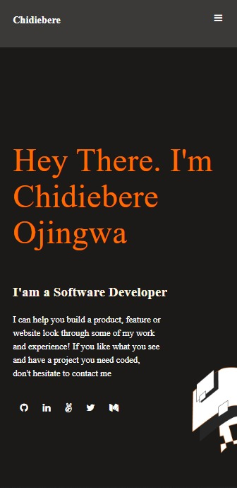

#Hello microverse

This repository is an intro project to microverse with HTML,CSS and Linters. 

## Built With
HTML
CSS
JavaScript
### Setup
clone to you local machine
create a directory on a your local machin.
open your terminal and type: git clone https://github.com/chidiebereojingwa/Hello_Microverse.git
### Usage
Clone project to your local machine 
run the index.html
## Live Demo
https://chidiebereojingwa.github.io/portfolior_microverse/
## Authors

👤 **Author1**

- GitHub: [@githubhandle](https://github.com/chidiebereojingwa)
- Twitter: [@twitterhandle](https://twitter.com/ojingwa)
- LinkedIn: [LinkedIn](https://linkedin.com/in/chidiebereojingwa)
## 📝 License

This project is [MIT](./MIT.md) licensed.

